# 🗺️ TrailBlazer - Advanced Pathfinding Visualization

[](https://opensource.org/licenses/MIT)
[](https://developer.mozilla.org/en-US/docs/Web/JavaScript)
[](https://leafletjs.com/)
[](https://www.openstreetmap.org/)

A sophisticated, interactive web application that demonstrates **Dijkstra's pathfinding algorithm** with real-world mapping capabilities. Built with vanilla JavaScript, Leaflet.js, and featuring a beautiful responsive design with dark/light theme system.

## 🌟 Features Overview

### 🎯 Core Pathfinding Features
- **Interactive Map Interface** - Click-to-set start/end points with visual markers
- **Dijkstra's Algorithm Visualization** - Watch the shortest path algorithm in action
- **Real-time Route Calculation** - Powered by OpenStreetMap Routing Machine (OSRM)
- **Multiple Travel Modes** - Walking (4.5 km/h), Cycling (15 km/h), Driving (35 km/h)
- **Advanced Waypoint System** - Add unlimited intermediate stops with search functionality
- **Turn-by-Turn Navigation** - Detailed step-by-step directions

### 🎨 User Interface Excellence
- **Responsive Design** - Seamless experience across desktop, tablet, and mobile
- **Dark/Light Theme System** - Toggle between themes with automatic map adaptation
- **Collapsible Sidebar** - Maximize map viewing area when needed
- **Smart Autocomplete Search** - Intelligent location suggestions for all inputs
- **Real-time Status Notifications** - Instant feedback for all user actions
- **Professional Animations** - Smooth transitions and micro-interactions

### 🔍 Advanced Search Capabilities
- **Nominatim Integration** - Powered by OpenStreetMap's geocoding service
- **GPS Location Support** - Use current location as starting point
- **Reverse Geocoding** - Automatic conversion of coordinates to readable addresses
- **Debounced Search** - Optimized API calls with 300ms delay
- **Keyboard Navigation** - Enter to select, Escape to cancel

## 🚀 Quick Start Guide

### Prerequisites
- Modern web browser (Chrome 80+, Firefox 75+, Safari 13+, Edge 80+)
- Stable internet connection for map tiles and geocoding services
- No additional software installation required

### Installation Methods

#### Method 1: Direct Download
```bash
# Clone the repository
git clone https://github.com/yourusername/trailblazer-pathfinding.git
cd trailblazer-pathfinding

# Open in browser
open index.html
```

#### Method 2: Local Server (Recommended)
```bash
# Using Python
python -m http.server 8000
# Visit: http://localhost:8000

# Using Node.js
npx http-server
# Visit: http://localhost:8080

# Using PHP
php -S localhost:8000
# Visit: http://localhost:8000
```

#### Method 3: Live Server (VS Code)
1. Install "Live Server" extension in VS Code
2. Right-click on `index.html`
3. Select "Open with Live Server"

## 📊 Application Flow Chart

```mermaid
flowchart TD
    A[🌐 Application Start] --> B[🎨 Initialize Theme System]
    B --> C[🗺️ Initialize Leaflet Map]
    C --> D[🎯 Load Map Tiles Based on Theme]
    D --> E[⚡ Setup Event Listeners]
    E --> F[🔍 Initialize Autocomplete System]
    
    F --> G{👤 User Action}
    
    G -->|📍 Set Start Location| H[🔍 Search Location]
    G -->|🎯 Set End Location| I[🔍 Search Location]
    G -->|➕ Add Waypoint| J[🔍 Search Waypoint]
    G -->|🌙 Toggle Theme| K[🎨 Switch Theme & Map Tiles]
    G -->|🔄 Run Algorithm| L[⚡ Execute Dijkstra's Algorithm]
    
    H --> M[📍 Place Start Marker]
    I --> N[🎯 Place End Marker]
    J --> O[➕ Add Waypoint Marker]
    
    M --> P{✅ Both Points Set?}
    N --> P
    O --> P
    
    P -->|Yes| Q[🛣️ Calculate Real Route via OSRM]
    P -->|No| R[⏳ Wait for Complete Input]
    
    Q --> S[📊 Create Graph from Route Points]
    S --> T[🔗 Generate Nodes and Edges]
    T --> U[📏 Calculate Haversine Distances]
    
    L --> V[🧠 Dijkstra's Algorithm Execution]
    V --> W[📋 Initialize Distance & Previous Maps]
    W --> X[🔄 Process Unvisited Nodes]
    X --> Y[📊 Find Minimum Distance Node]
    Y --> Z[🔍 Update Neighbor Distances]
    Z --> AA{🎯 Reached Destination?}
    
    AA -->|No| X
    AA -->|Yes| BB[🛤️ Reconstruct Optimal Path]
    
    BB --> CC[📍 Display Route on Map]
    CC --> DD[📋 Show Turn-by-Turn Directions]
    DD --> EE[📊 Update Route Statistics]
    EE --> FF[✅ Algorithm Complete]
    
    K --> GG[🗺️ Update Map Tiles]
    GG --> HH[💾 Save Theme Preference]
    
    R --> G
    FF --> G
    HH --> G
    
    style A fill:#e1f5fe
    style V fill:#f3e5f5
    style BB fill:#e8f5e8
    style FF fill:#fff3e0
```



## 🎮 Detailed Usage Guide

### 🗺️ Basic Route Planning

#### Step 1: Set Your Starting Point
```
Method 1: Search Input
1. Click on "Start Location" input field
2. Type your starting address (minimum 3 characters)
3. Select from autocomplete suggestions
4. Green marker appears on map

Method 2: GPS Location
1. Click the 📍 GPS button next to start input
2. Allow location access when prompted
3. Current location automatically set as start point
```

#### Step 2: Set Your Destination
```
1. Click on "End Location" input field
2. Type your destination address
3. Select from autocomplete suggestions
4. Red marker appears on map
5. Route automatically calculates and displays
```

#### Step 3: Choose Travel Mode
```
🚶 Walking Mode:
- Average speed: 4.5 km/h
- Pedestrian-friendly routes
- Sidewalks and walking paths prioritized

🚴 Cycling Mode:
- Average speed: 15 km/h
- Bike lanes and cycling routes
- Avoids highways and major roads

🚗 Driving Mode:
- Average speed: 35 km/h (city driving)
- Optimized for vehicles
- Uses roads and highways
```

### ➕ Advanced Waypoint Management

#### Adding Waypoints via Search
```
1. Click "Search & Add Waypoint" button
2. Search input field appears with focus
3. Type location name (minimum 3 characters)
4. Autocomplete suggestions populate
5. Click desired location from suggestions
6. Orange waypoint marker added to map
7. Route recalculates through all waypoints
8. Search field automatically hides
```

#### Managing Waypoints
```
View Waypoints:
- All waypoints listed in sidebar
- Shows actual place names (not generic labels)
- Long names truncated with "..." (hover for full name)

Remove Individual Waypoints:
- Click "Remove" button next to waypoint name
- Marker disappears from map
- Route recalculates automatically

Clear All Waypoints:
- Click "Clear All" button
- All waypoint markers removed
- Route returns to direct start-to-end path
```

### 🧠 Running Dijkstra's Algorithm

#### Algorithm Execution Process
```
1. Ensure start and end points are set
2. Click "Run Dijkstra's Algorithm" button
3. Loading overlay appears with spinner
4. Algorithm processes route graph:
   - Creates nodes from route points
   - Calculates distances between nodes
   - Finds shortest path using Dijkstra's method
5. Visual feedback during processing
6. Results displayed with success message
```

#### Understanding the Results
```
Route Information Panel Shows:
- Distance: Total route length in km/miles
- Duration: Estimated travel time
- Est. Time: Calculated based on travel mode

Turn-by-Turn Directions:
- Step-by-step navigation instructions
- Distance for each segment
- Numbered steps for easy following
- Expandable/collapsible panel
```

### 🎨 Theme and Interface Controls

#### Theme Switching
```
Light Theme:
- Bright OpenStreetMap tiles
- Clean white interface
- High contrast for daylight use
- Professional blue accent colors

Dark Theme:
- CartoDB Dark Matter map tiles
- Dark blue interface with slate colors
- Reduced eye strain for low-light use
- Maintains excellent readability
```

#### Interface Management
```
Sidebar Toggle (☰):
- Collapse sidebar to maximize map view
- Sidebar width: 350px → 60px
- App title fades out when collapsed
- Map automatically resizes

Directions Panel (▲/▼):
- Expand/collapse turn-by-turn directions
- Default height: 300px
- Slides up from bottom of screen
- Automatically shows when route calculated
```

## 🏗️ Technical Architecture Deep Dive

### 📁 File Structure and Responsibilities

```
trailblazer-pathfinding/
├── 📄 index.html              # Main HTML structure and layout
├── 🎨 styles.css              # Complete CSS styling and themes
├── ⚡ script.js               # Core application logic and map handling
├── 🧠 pathfinding.js          # Dijkstra's algorithm implementation
├── 🎛️ ui.js                   # UI management and theme system
└── 📖 README.md               # This documentation file
```

#### index.html - Structure & Layout
```html
Key Components:
- Semantic HTML5 structure
- Responsive meta viewport
- External library imports (Leaflet, Routing Machine)
- Accessibility-friendly form controls
- Status message container
- Loading overlay system
```

#### styles.css - Styling & Theming
```css
Features:
- CSS Custom Properties for theming
- Glassmorphism effects with backdrop-filter
- Responsive breakpoints for mobile/desktop
- Smooth animations and transitions
- Dark/light theme variables
- Professional color palette
```

#### script.js - Core Application Logic
```javascript
Primary Responsibilities:
- Leaflet map initialization and management
- Event listener setup and handling
- OSRM routing integration
- Marker creation and management
- Autocomplete search implementation
- Theme switching logic
- UI state management
```

#### pathfinding.js - Algorithm Implementation
```javascript
Core Functions:
- Dijkstra's algorithm implementation
- Graph creation from route points
- Haversine distance calculations
- Path reconstruction
- Node and edge management
- Algorithm visualization timing
```

#### ui.js - User Interface Management
```javascript
UI Components:
- Theme system management
- Status message handling
- Loading overlay control
- Sidebar collapse/expand
- Directions panel toggle
- Input validation
- Animation controls
```

### 🔗 API Integrations and Data Flow

#### OpenStreetMap Nominatim API
```javascript
Purpose: Geocoding and reverse geocoding
Endpoints:
- Search: https://nominatim.openstreetmap.org/search
- Reverse: https://nominatim.openstreetmap.org/reverse

Features:
- Address to coordinates conversion
- Coordinates to address conversion
- Autocomplete suggestions
- Rate limiting respect (300ms debounce)
- Error handling and fallbacks
```

#### OSRM (Open Source Routing Machine)
```javascript
Purpose: Real-world route calculation
Endpoint: https://router.project-osrm.org/route/v1
Profiles: driving, cycling, foot

Capabilities:
- Multi-modal routing
- Turn-by-turn directions
- Route optimization
- Waypoint support
- Distance and time calculations
```

#### CartoDB Map Tiles
```javascript
Light Theme: OpenStreetMap standard tiles
Dark Theme: CartoDB Dark Matter tiles

Features:
- High-quality map rendering
- No API key required
- Reliable CDN delivery
- Proper attribution
- Zoom levels 1-19
```

### 🧠 Algorithm Implementation Details

#### Dijkstra's Algorithm Breakdown

```javascript
Data Structures Used:
- Map<Node, Number> distances    // Distance from start to each node
- Map<Node, Node> previous       // Previous node in optimal path
- Set<Node> unvisited           // Nodes not yet processed

Time Complexity: O((V + E) log V)
Space Complexity: O(V)
Where V = vertices (nodes), E = edges
```

#### Graph Creation Process

```javascript
Input: Array of [latitude, longitude] coordinates
Process:
1. Convert coordinates to node objects
2. Calculate Haversine distances between consecutive nodes
3. Create bidirectional edges with distance weights
4. Build adjacency list representation

Output: {nodes: Array, edges: Map}
```

#### Haversine Distance Formula

```javascript
Purpose: Calculate great-circle distance between two points on Earth
Formula: 
  a = sin²(Δφ/2) + cos φ1 ⋅ cos φ2 ⋅ sin²(Δλ/2)
  c = 2 ⋅ atan2(√a, √(1−a))
  d = R ⋅ c

Where:
  φ = latitude in radians
  λ = longitude in radians
  R = Earth's radius (6,371 km)
  Δ = difference between coordinates
```

### 📱 Responsive Design Implementation

#### Breakpoint Strategy
```css
Desktop (> 768px):
- Full sidebar (350px width)
- Large map area
- Horizontal layout
- All features visible

Mobile (≤ 768px):
- Collapsible sidebar overlay
- Vertical layout
- Touch-optimized controls
- Simplified interface
```

#### Mobile Optimizations
```javascript
Features:
- Touch-friendly button sizes (44px minimum)
- Swipe gestures for sidebar
- Optimized autocomplete for mobile keyboards
- Responsive map controls
- Simplified directions panel
```

## 🔧 Advanced Customization Guide

### 🎨 Theme Customization

#### Adding New Themes
```css
/* Add to styles.css */
[data-theme="custom"] {
  --bg-primary: #your-color;
  --text-primary: #your-color;
  --primary: #your-accent-color;
  /* ... other variables */
}
```

#### Custom Map Tiles
```javascript
// Add to updateMapTiles() function in script.js
if (currentTheme === 'custom') {
    currentTileLayer = L.tileLayer('https://your-tile-server/{z}/{x}/{y}.png', {
        attribution: 'Your Attribution'
    }).addTo(map);
}
```

### 🗺️ Map Customization

#### Custom Marker Styles
```javascript
// Modify createCustomIcon() function
function createCustomIcon(type) {
    const styles = {
        start: { color: '#your-color', icon: '🏁' },
        end: { color: '#your-color', icon: '🎯' },
        waypoint: { color: '#your-color', icon: '📍' }
    };
    // Implementation...
}
```

#### Additional Map Controls
```javascript
// Add custom controls to map
const customControl = L.control({position: 'topright'});
customControl.onAdd = function(map) {
    const div = L.DomUtil.create('div', 'custom-control');
    div.innerHTML = '<button>Custom Action</button>';
    return div;
};
customControl.addTo(map);
```

### 🧠 Algorithm Extensions

#### Adding New Pathfinding Algorithms
```javascript
// Add to pathfinding.js
async bellmanFord(startNode, endNode, nodes, edges) {
    // Implementation for Bellman-Ford algorithm
    // Handles negative edge weights
    // Time complexity: O(VE)
}

async floydWarshall(nodes, edges) {
    // Implementation for Floyd-Warshall algorithm
    // All-pairs shortest path
    // Time complexity: O(V³)
}
```

#### Custom Heuristic Functions
```javascript
// For future A* implementation
function manhattanDistance(node1, node2) {
    return Math.abs(node1.x - node2.x) + Math.abs(node1.y - node2.y);
}

function euclideanDistance(node1, node2) {
    return Math.sqrt(Math.pow(node1.x - node2.x, 2) + Math.pow(node1.y - node2.y, 2));
}
```

## 🚀 Performance Optimization

### ⚡ Current Optimizations

#### API Call Optimization
```javascript
Features:
- 300ms debounce on search inputs
- Request cancellation for outdated searches
- Caching of geocoding results
- Minimal API calls through smart state management
```

#### Rendering Optimization
```javascript
Techniques:
- CSS transforms for smooth animations
- RequestAnimationFrame for smooth scrolling
- Efficient DOM manipulation
- Lazy loading of map tiles
- Optimized marker clustering for large datasets
```

#### Memory Management
```javascript
Practices:
- Proper event listener cleanup
- Map layer removal before adding new ones
- Garbage collection friendly coding
- Minimal global variables
- Efficient data structure usage
```

### 📊 Performance Metrics

```
Typical Performance:
- Initial load time: < 2 seconds
- Route calculation: < 1 second
- Theme switching: < 300ms
- Search autocomplete: < 500ms response
- Map tile loading: < 1 second per tile
- Algorithm execution: < 2 seconds (with visualization delays)
```

## 🧪 Testing and Quality Assurance

### ✅ Manual Testing Checklist

#### Core Functionality
```
□ Start location search and selection
□ End location search and selection
□ Waypoint addition and removal
□ Route calculation accuracy
□ Dijkstra's algorithm execution
□ Turn-by-turn directions display
□ Theme switching functionality
□ Responsive design on multiple devices
```

#### Edge Cases
```
□ Invalid location searches
□ Network connectivity issues
□ GPS permission denied
□ Very long route calculations
□ Multiple rapid theme switches
□ Sidebar collapse/expand during route calculation
□ Mobile device orientation changes
```

#### Browser Compatibility
```
□ Chrome (latest 3 versions)
□ Firefox (latest 3 versions)
□ Safari (latest 2 versions)
□ Edge (latest 2 versions)
□ Mobile browsers (iOS Safari, Chrome Mobile)
```

### 🐛 Common Issues and Solutions

#### Issue: Map tiles not loading
```
Solution:
1. Check internet connection
2. Verify tile server availability
3. Clear browser cache
4. Check for CORS issues in console
```

#### Issue: Geocoding not working
```
Solution:
1. Verify Nominatim API accessibility
2. Check for rate limiting (wait 1 minute)
3. Try different search terms
4. Check browser console for errors
```

#### Issue: Dark theme map appears grey
```
Solution:
1. Refresh the page
2. Toggle theme twice
3. Check if CartoDB tiles are accessible
4. Verify CSS theme variables are loaded
```

## 🤝 Contributing Guidelines

### 🔄 Development Workflow

#### Setting Up Development Environment
```bash
1. Fork the repository on GitHub
2. Clone your fork locally
3. Create a feature branch
4. Make your changes
5. Test thoroughly
6. Submit a pull request
```

#### Code Style Guidelines
```javascript
Standards:
- Use camelCase for variables and functions
- Use PascalCase for classes
- Use UPPER_SNAKE_CASE for constants
- Indent with 4 spaces
- Use semicolons consistently
- Add JSDoc comments for functions
- Follow existing naming conventions
```

#### Commit Message Format
```
Format: type(scope): description

Types:
- feat: New feature
- fix: Bug fix
- docs: Documentation changes
- style: Code style changes
- refactor: Code refactoring
- test: Adding tests
- chore: Maintenance tasks

Examples:
feat(pathfinding): add Bellman-Ford algorithm
fix(ui): resolve dark theme loading issue
docs(readme): update installation instructions
```

### 🎯 Areas for Contribution

#### High Priority
```
- Additional pathfinding algorithms (A*, Bellman-Ford)
- Offline map tile caching
- Route export functionality (GPX, KML)
- Performance optimizations
- Accessibility improvements
```

#### Medium Priority
```
- Additional map tile providers
- Custom marker upload
- Route sharing via URL
- Multi-language support
- Advanced route preferences
```

#### Low Priority
```
- Social media integration
- Route history storage
- Advanced statistics
- Custom themes
- Plugin system
```

## 📄 License and Legal

### MIT License
```
Copyright (c) 2024 TrailBlazer Pathfinding

Permission is hereby granted, free of charge, to any person obtaining a copy
of this software and associated documentation files (the "Software"), to deal
in the Software without restriction, including without limitation the rights
to use, copy, modify, merge, publish, distribute, sublicense, and/or sell
copies of the Software, and to permit persons to whom the Software is
furnished to do so, subject to the following conditions:

The above copyright notice and this permission notice shall be included in all
copies or substantial portions of the Software.

THE SOFTWARE IS PROVIDED "AS IS", WITHOUT WARRANTY OF ANY KIND, EXPRESS OR
IMPLIED, INCLUDING BUT NOT LIMITED TO THE WARRANTIES OF MERCHANTABILITY,
FITNESS FOR A PARTICULAR PURPOSE AND NONINFRINGEMENT.
```

### Third-Party Licenses
```
Dependencies:
- Leaflet.js: BSD 2-Clause License
- Leaflet Routing Machine: ISC License
- OpenStreetMap: Open Database License (ODbL)
- CartoDB: Creative Commons Attribution 3.0
- Nominatim: Open Database License (ODbL)
```

## 🙏 Acknowledgments and Credits

### 🌟 Open Source Projects
- **[Leaflet.js](https://leafletjs.com/)** - Excellent open-source mapping library
- **[OpenStreetMap](https://www.openstreetmap.org/)** - Collaborative mapping project
- **[OSRM](http://project-osrm.org/)** - High-performance routing engine
- **[CartoDB](https://carto.com/)** - Beautiful map tile services
- **[Nominatim](https://nominatim.org/)** - Geocoding service

### 🎨 Design Inspiration
- **Apple Maps** - Clean, intuitive interface design
- **Google Maps** - Comprehensive feature set
- **Mapbox** - Modern styling and animations
- **Strava** - Route planning and visualization

### 📚 Educational Resources
- **Introduction to Algorithms (CLRS)** - Algorithm theory foundation
- **MDN Web Docs** - JavaScript and web API references
- **Leaflet Documentation** - Mapping library guidance
- **OpenStreetMap Wiki** - Mapping data understanding

## 📞 Support and Community

### 🆘 Getting Help

#### Documentation
```
1. Read this README thoroughly
2. Check the inline code comments
3. Review the flowchart for understanding
4. Test with the provided examples
```

#### Community Support
```
- GitHub Issues: Bug reports and feature requests
- GitHub Discussions: General questions and ideas
- Stack Overflow: Technical programming questions
- OpenStreetMap Community: Mapping-related questions
```

#### Reporting Issues
```
When reporting bugs, please include:
1. Browser and version
2. Operating system
3. Steps to reproduce
4. Expected vs actual behavior
5. Console error messages
6. Screenshots if applicable
```

### 🔮 Future Roadmap

#### Version 2.0 (Planned)
```
- A* algorithm implementation
- Offline functionality
- Route export/import
- Advanced preferences
- Performance dashboard
```

#### Version 3.0 (Vision)
```
- Real-time traffic integration
- Multi-modal transportation
- Collaborative route planning
- Mobile app version
- API for third-party integration
```

---

## 🎉 Quick Start Summary

1. **Download** or clone the repository
2. **Open** `index.html` in your browser
3. **Enter** start and end locations
4. **Add** waypoints if desired
5. **Run** Dijkstra's algorithm
6. **Explore** the results and directions
7. **Toggle** between light and dark themes
8. **Enjoy** learning about pathfinding algorithms!

**Built with ❤️ for education, exploration, and the joy of pathfinding algorithms**

---

*Last updated: 2025 | Version 1.0 | MIT License*
