# 🗺️ TrailBlazer - Advanced Pathfinding Visualization

[](https://opensource.org/licenses/MIT)
[](https://developer.mozilla.org/en-US/docs/Web/JavaScript)
[](https://leafletjs.com/)
[](https://www.openstreetmap.org/)

A sophisticated, interactive web application that demonstrates **Dijkstra's pathfinding algorithm** with real-world mapping capabilities. Built with vanilla JavaScript, Leaflet.js, and featuring a beautiful responsive design with dark/light theme system.

## 🌟 Features Overview

### 🎯 Core Pathfinding Features
- **Interactive Map Interface** - Click-to-set start/end points with visual markers
- **Dijkstra's Algorithm Visualization** - Watch the shortest path algorithm in action
- **Real-time Route Calculation** - Powered by OpenStreetMap Routing Machine (OSRM)
- **Multiple Travel Modes** - Walking (4.5 km/h), Cycling (15 km/h), Driving (35 km/h)
- **Advanced Waypoint System** - Add unlimited intermediate stops with intelligent search
- **Turn-by-Turn Navigation** - Detailed step-by-step directions
- **On-Demand Route Display** - Routes only appear after running Dijkstra's algorithm

### 🎨 User Interface Excellence
- **Fully Responsive Design** - Seamless experience across desktop, tablet, and mobile
- **Mobile-First Approach** - Collapsible sidebar, touch-optimized controls
- **Dark/Light Theme System** - Toggle between themes with automatic map adaptation
- **Smart Autocomplete Search** - Intelligent location suggestions for all inputs
- **Real-time Status Notifications** - Instant feedback for all user actions
- **Professional Animations** - Smooth transitions and micro-interactions

### 🔍 Advanced Search Capabilities
- **Nominatim Integration** - Powered by OpenStreetMap's geocoding service
- **GPS Location Support** - Use current location as starting point
- **Reverse Geocoding** - Automatic conversion of coordinates to readable addresses
- **Debounced Search** - Optimized API calls with 300ms delay
- **Keyboard Navigation** - Enter to select, Escape to cancel
- **Real Place Names** - Waypoints display actual location names

## 🚀 Quick Start Guide

### Prerequisites
- Modern web browser (Chrome 80+, Firefox 75+, Safari 13+, Edge 80+)
- Stable internet connection for map tiles and geocoding services
- No additional software installation required

### Installation Methods

#### Method 1: Direct Download
```bash
git clone https://github.com/yourusername/trailblazer-pathfinding.git
cd trailblazer-pathfinding
open index.html
```

#### Method 2: Local Server (Recommended)
```bash
# Using Python
python -m http.server 8000
# Visit: http://localhost:8000

# Using Node.js
npx http-server
# Visit: http://localhost:8080

# Using PHP
php -S localhost:8000
# Visit: http://localhost:8000
```

#### Method 3: Live Server (VS Code)
1. Install "Live Server" extension in VS Code
2. Right-click on `index.html`
3. Select "Open with Live Server"

## 📊 Application Flow Chart

```mermaid
flowchart TD
    A[🌐 Application Start] --> B[🎨 Initialize Theme System]
    B --> C[🗺️ Initialize Leaflet Map]
    C --> D[🎯 Load Map Tiles Based on Theme]
    D --> E[⚡ Setup Event Listeners]
    E --> F[🔍 Initialize Autocomplete System]
    
    F --> G{👤 User Action}
    
    G -->|📍 Set Start Location| H[🔍 Search Location]
    G -->|🎯 Set End Location| I[🔍 Search Location]
    G -->|➕ Add Waypoint| J[🔍 Search Waypoint]
    G -->|🌙 Toggle Theme| K[🎨 Switch Theme & Map Tiles]
    G -->|☰ Toggle Sidebar| L[📱 Show/Hide Mobile Sidebar]
    G -->|🔄 Run Algorithm| M[⚡ Execute Dijkstra's Algorithm]
    
    H --> N[📍 Place Start Marker]
    I --> O[🎯 Place End Marker]
    J --> P[➕ Add Waypoint Marker with Real Name]
    
    N --> Q{✅ Both Points Set?}
    O --> Q
    P --> Q
    
    Q -->|Yes| R[🔘 Enable Dijkstra Button]
    Q -->|No| S[⏳ Keep Button Disabled]
    
    M --> T{✅ Valid Route Points?}
    T -->|No| U[❌ Show Error Message]
    T -->|Yes| W[📊 Create Graph from Route Points]
    
    W --> X[🔗 Generate Nodes and Edges]
    X --> Y[📏 Calculate Haversine Distances]
    Y --> Z[🧠 Dijkstra's Algorithm Execution]
    
    Z --> AA[📋 Initialize Distance & Previous Maps]
    AA --> BB[🔄 Process Unvisited Nodes]
    BB --> CC[📊 Find Minimum Distance Node]
    CC --> DD[🔍 Update Neighbor Distances]
    DD --> EE{🎯 Reached Destination?}
    
    EE -->|No| BB
    EE -->|Yes| FF[🛤️ Reconstruct Optimal Path]
    
    FF --> V[🛣️ Calculate Real Route via OSRM]
    V --> GG[📍 Display Route on Map]
    GG --> HH[📋 Show Turn-by-Turn Directions]
    HH --> II[📊 Update Route Statistics]
    II --> JJ[✅ Algorithm Complete]
    
    K --> KK[🗺️ Update Map Tiles]
    KK --> LL[💾 Save Theme Preference]
    
    L --> MM{📱 Mobile Device?}
    MM -->|Yes| NN[📱 Slide Sidebar with Overlay]
    MM -->|No| OO[🖥️ Collapse to 60px Width]
    
    S --> G
    R --> G
    JJ --> G
    LL --> G
    NN --> G
    OO --> G
    U --> G

    style A fill:#e1f5fe
    style Z fill:#f3e5f5
    style FF fill:#e8f5e8
    style JJ fill:#fff3e0
    style MM fill:#fce4ec

```



## 🎮 Detailed Usage Guide

### 🗺️ Basic Route Planning

#### Step 1: Set Your Starting Point
```
Method 1: Search Input
1. Click on "Start Location" input field
2. Type your starting address (minimum 3 characters)
3. Select from autocomplete suggestions
4. Green marker appears on map

Method 2: GPS Location
1. Click the 📍 GPS button next to start input
2. Allow location access when prompted
3. Current location automatically set as start point
```

#### Step 2: Set Your Destination
```
1. Click on "End Location" input field
2. Type your destination address
3. Select from autocomplete suggestions
4. Red marker appears on map
5. Dijkstra button becomes enabled
```

#### Step 3: Choose Travel Mode
```
🚶 Walking Mode:
- Average speed: 4.5 km/h
- Pedestrian-friendly routes
- Sidewalks and walking paths prioritized

🚴 Cycling Mode:
- Average speed: 15 km/h
- Bike lanes and cycling routes
- Avoids highways and major roads

🚗 Driving Mode:
- Average speed: 35 km/h (city driving)
- Optimized for vehicles
- Uses roads and highways
```

#### Step 4: Run Dijkstra's Algorithm
```
1. Ensure start and end points are set
2. Click "Run Dijkstra's Algorithm" button
3. Loading overlay appears with spinner
4. Route appears on map with turn-by-turn directions
5. Route information panel updates with statistics
```

### ➕ Advanced Waypoint Management

#### Adding Waypoints via Search
```
1. Click "Search & Add Waypoint" button
2. Search input field appears with focus
3. Type location name (minimum 3 characters)
4. Autocomplete suggestions populate with real places
5. Click desired location from suggestions
6. Orange waypoint marker added with actual place name
7. Search field automatically hides
8. Waypoint appears in list with real location name
```

#### Managing Waypoints
```
View Waypoints:
- All waypoints listed with actual place names
- Shows real locations like "Times Square, New York"
- Long names truncated with "..." (hover for full name)

Remove Individual Waypoints:
- Click "Remove" button next to waypoint name
- Marker disappears from map
- List updates automatically

Clear All Waypoints:
- Click "Clear All" button
- All waypoint markers removed
- Waypoint list clears
```

### 📱 Mobile Experience

#### Sidebar Behavior
```
Mobile (≤768px):
- Sidebar collapsed by default
- Tap hamburger (☰) button to open
- Sidebar slides in as overlay
- Dark backdrop appears behind sidebar
- Tap outside or hamburger to close

Desktop (>768px):
- Normal sidebar behavior
- Toggle collapses to 60px width
- No overlay needed
```

#### Touch Optimizations
```
- 44px minimum touch targets
- Larger buttons and inputs
- Touch-friendly autocomplete
- Smooth slide animations
- Orientation change support
```

### 🎨 Theme and Interface Controls

#### Theme Switching
```
Light Theme:
- Bright OpenStreetMap tiles
- Clean white interface
- High contrast for daylight use
- Professional blue accent colors

Dark Theme:
- CartoDB Dark Matter map tiles
- Dark blue interface with slate colors
- Reduced eye strain for low-light use
- Maintains excellent readability
- Loads correctly from first page load
```

#### Interface Management
```
Directions Panel (▲/▼):
- Expand/collapse turn-by-turn directions
- Automatically shows when algorithm runs
- Slides up from bottom of screen
- Touch-friendly toggle button
```

## 🏗️ Technical Architecture

### 📁 File Structure
```
trailblazer-pathfinding/
├── 📄 index.html              # Main HTML structure and layout
├── 🎨 styles.css              # Complete CSS styling and responsive design
├── ⚡ script.js               # Core application logic and map handling
├── 🧠 pathfinding.js          # Dijkstra's algorithm implementation
├── 🎛️ ui.js                   # UI management and theme system
└── 📖 README.md               # This documentation file
```

### 🔗 API Integrations

#### OpenStreetMap Nominatim API
```javascript
Purpose: Geocoding and reverse geocoding
Features:
- Address to coordinates conversion
- Coordinates to address conversion
- Autocomplete suggestions with real place names
- Rate limiting respect (300ms debounce)
- Error handling and fallbacks
```

#### OSRM (Open Source Routing Machine)
```javascript
Purpose: Real-world route calculation
Profiles: driving, cycling, foot
Features:
- Multi-modal routing
- Turn-by-turn directions
- Route optimization
- Waypoint support
- Distance and time calculations
```

### 🧠 Algorithm Implementation

#### Dijkstra's Algorithm
```javascript
Key Features:
- Graph creation from route points
- Haversine distance calculations
- Shortest path finding
- Visual feedback during processing
- Route reconstruction and display

Time Complexity: O((V + E) log V)
Space Complexity: O(V)
Where V = vertices (nodes), E = edges
```

### 📱 Responsive Design

#### Breakpoint Strategy
```css
Desktop (> 768px):
- Full sidebar (350px width)
- Large map area
- Horizontal layout
- All features visible

Mobile (≤ 768px):
- Collapsible sidebar overlay
- Vertical layout
- Touch-optimized controls
- Simplified interface

Small Mobile (≤ 480px):
- Optimized spacing
- Larger text and buttons
- Better proportions

Extra Small (≤ 320px):
- Minimal spacing
- Maximum content utilization
```

## 🔧 Key Features Explained

### 🎯 Route Display Logic
- **Routes only appear after clicking "Run Dijkstra's Algorithm"**
- **Markers are placed immediately** when locations are set
- **Button is disabled** until both start and end points are set
- **Visual feedback** shows when algorithm can be run

### 🏷️ Real Place Names
- **Waypoints show actual location names** instead of generic labels
- **Reverse geocoding** converts coordinates to readable addresses
- **Truncated display** for long names with hover tooltips
- **Fallback to coordinates** if geocoding fails

### 📱 Mobile-First Design
- **Sidebar collapsed by default** on mobile devices
- **Touch-optimized interactions** throughout the interface
- **Responsive breakpoints** for all screen sizes
- **Orientation change support** for mobile devices

### 🎨 Theme System
- **Automatic theme detection** and application
- **Map tiles update** to match selected theme
- **Persistent theme preference** saved in localStorage
- **Smooth transitions** between light and dark modes

## 🧪 Browser Compatibility

### ✅ Supported Browsers
- **Chrome 80+** (Recommended)
- **Firefox 75+**
- **Safari 13+**
- **Edge 80+**
- **Mobile browsers** (iOS Safari, Chrome Mobile)

### 📱 Mobile Support
- **iOS Safari 13+**
- **Chrome Mobile 80+**
- **Samsung Internet 12+**
- **Firefox Mobile 75+**

## 🚀 Performance Features

### ⚡ Optimizations
- **Debounced search** (300ms) to reduce API calls
- **Efficient DOM manipulation** for smooth interactions
- **CSS transforms** for hardware-accelerated animations
- **Lazy loading** of map tiles
- **Memory management** with proper cleanup

### 📊 Typical Performance
- **Initial load time**: < 2 seconds
- **Route calculation**: < 1 second
- **Theme switching**: < 300ms
- **Search autocomplete**: < 500ms response
- **Algorithm execution**: < 2 seconds (with visualization)

## 🤝 Contributing

### 🔄 Development Setup
```bash
1. Fork the repository on GitHub
2. Clone your fork locally
3. Create a feature branch
4. Make your changes
5. Test thoroughly on multiple devices
6. Submit a pull request
```

### 📝 Code Standards
- **Clean, comment-free production code**
- **Consistent naming conventions**
- **Mobile-first responsive design**
- **Accessibility considerations**
- **Cross-browser compatibility**

### 🎯 Areas for Contribution
- **Additional pathfinding algorithms** (A*, Bellman-Ford)
- **Offline map functionality**
- **Route export capabilities** (GPX, KML)
- **Advanced mobile gestures**
- **Performance optimizations**

## 📄 License

### MIT License
```
Copyright (c) 2024 TrailBlazer Pathfinding

Permission is hereby granted, free of charge, to any person obtaining a copy
of this software and associated documentation files (the "Software"), to deal
in the Software without restriction, including without limitation the rights
to use, copy, modify, merge, publish, distribute, sublicense, and/or sell
copies of the Software, and to permit persons to whom the Software is
furnished to do so, subject to the following conditions:

The above copyright notice and this permission notice shall be included in all
copies or substantial portions of the Software.
```

## 🙏 Acknowledgments

### 🌟 Open Source Projects
- **[Leaflet.js](https://leafletjs.com/)** - Excellent mapping library
- **[OpenStreetMap](https://www.openstreetmap.org/)** - Collaborative mapping data
- **[OSRM](http://project-osrm.org/)** - High-performance routing engine
- **[CartoDB](https://carto.com/)** - Beautiful dark theme map tiles
- **[Nominatim](https://nominatim.org/)** - Geocoding service

### 🎨 Design Inspiration
- **Apple Maps** - Clean, intuitive mobile interface
- **Google Maps** - Comprehensive feature set
- **Modern mobile apps** - Touch-first design principles

## 📞 Support

### 🆘 Getting Help
- **GitHub Issues**: Bug reports and feature requests
- **Documentation**: This comprehensive README
- **Code Comments**: Inline documentation in source files

### 🐛 Reporting Issues
When reporting bugs, please include:
1. **Device and browser information**
2. **Screen size and orientation**
3. **Steps to reproduce the issue**
4. **Expected vs actual behavior**
5. **Console error messages**
6. **Screenshots if applicable**

---

## 🎉 Quick Start Summary

1. **Open** `index.html` in your browser
2. **Set theme** preference (light/dark)
3. **Enter** start and end locations using search
4. **Add waypoints** if desired using search functionality
5. **Click** "Run Dijkstra's Algorithm" to see the route
6. **View** turn-by-turn directions in the bottom panel
7. **On mobile**: Tap ☰ to access sidebar controls

**Built with ❤️ for education, exploration, and the joy of pathfinding algorithms**

---

*Last updated: 2025 | Fully Responsive & Mobile-Optimized*
